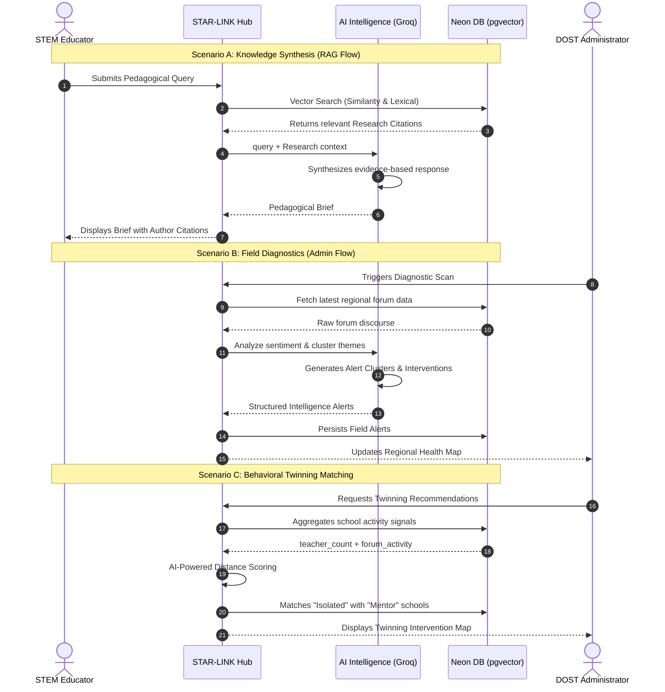

<div align="center">
  

TESTING 4

# STAR-LINK

**Community Collaboration Hub for STEM Educators**


</div>

---

## Table of Contents

1. [Overview](#overview)
2. [Tech Stack](#tech-stack)
3. [Interactive Intelligence Flow](#interactive-intelligence-flow)
4. [Repository Structure](#repository-structure)
5. [Core Features](#core-features)
6. [Screenshots](#screenshots)
7. [Getting Started](#getting-started)
8. [Environment Variables](#environment-variables)
9. [Available Scripts](#available-scripts)
10. [UI/UX Design Direction](#uiux-design-direction)
11. [Security Hardening](#security-hardening)
12. [Production Readiness](#production-readiness)
13. [Success Metrics](#success-metrics)
14. [Delivery Phases](#delivery-phases)
15. [Team](#team)

---

## Overview

Every repository must include a README.md file. This should explain what your project is, how it works, and how to set it up.

STAR-LINK is a community-driven collaboration hub designed to complement and enrich the e-STAR.ph platform. While e-STAR.ph serves as a static repository of lesson exemplars and training materials, STAR-LINK adds a dynamic social layer where educators can:

- Share action research and extension projects
- Discuss implementation challenges with peers
- Build mentorship and cross-school support networks

The goal is to transform isolated innovations into nationally shared assets for continuous STEM education improvement.

**Primary outcomes:**

- Increase educator participation in knowledge-sharing
- Support region-specific problem solving
- Provide evidence-based insights for STAR program planning

---

## Tech Stack

### Core Framework

<table width="100%" style="width: 100%; table-layout: fixed;">
  <thead>
    <tr>
      <th align="left" width="18%">Layer</th>
      <th align="left" width="28%">Technology</th>
      <th align="left" width="12%">Version</th>
      <th align="left" width="42%">Purpose</th>
    </tr>
  </thead>
  <tbody>
    <tr>
      <td>Framework</td>
      <td></td>
      <td>16.2</td>
      <td>Server-side rendering, routing, API routes</td>
    </tr>
    <tr>
      <td>UI Library</td>
      <td></td>
      <td>19.2</td>
      <td>Component-based user interface</td>
    </tr>
    <tr>
      <td>Language</td>
      <td></td>
      <td>5.x</td>
      <td>Static type safety across the codebase</td>
    </tr>
    <tr>
      <td>Styling</td>
      <td></td>
      <td>--</td>
      <td>Scoped component styles with shared design tokens</td>
    </tr>
  </tbody>
</table>

### Data and Authentication

<table width="100%" style="width: 100%; table-layout: fixed;">
  <thead>
    <tr>
      <th align="left" width="18%">Layer</th>
      <th align="left" width="28%">Technology</th>
      <th align="left" width="12%">Version</th>
      <th align="left" width="42%">Purpose</th>
    </tr>
  </thead>
  <tbody>
    <tr>
      <td>Database</td>
      <td></td>
      <td>--</td>
      <td>Serverless managed relational data store</td>
    </tr>
    <tr>
      <td>Query Layer</td>
      <td></td>
      <td>0.45</td>
      <td>Type-safe SQL queries and schema management</td>
    </tr>
    <tr>
      <td>Database Driver</td>
      <td></td>
      <td>1.x</td>
      <td>HTTP-based PostgreSQL driver for edge/serverless</td>
    </tr>
    <tr>
      <td>Schema Tooling</td>
      <td></td>
      <td>0.31</td>
      <td>Migration generation and schema push</td>
    </tr>
    <tr>
      <td>Authentication</td>
      <td></td>
      <td>--</td>
      <td>Server actions with bcryptjs password hashing</td>
    </tr>
    <tr>
      <td>Auth Integration</td>
      <td></td>
      <td>5.0-beta</td>
      <td>Available for OAuth/social login expansion</td>
    </tr>
  </tbody>
</table>

### Maps, Visualization, and Reporting

<table width="100%" style="width: 100%; table-layout: fixed;">
  <thead>
    <tr>
      <th align="left" width="18%">Layer</th>
      <th align="left" width="28%">Technology</th>
      <th align="left" width="12%">Version</th>
      <th align="left" width="42%">Purpose</th>
    </tr>
  </thead>
  <tbody>
    <tr>
      <td>Maps</td>
      <td></td>
      <td>1.9 / 5.0</td>
      <td>Interactive geospatial map and collaboration overlays</td>
    </tr>
    <tr>
      <td>Charts</td>
      <td></td>
      <td>3.8</td>
      <td>Admin dashboard analytics visualizations</td>
    </tr>
    <tr>
      <td>PDF Export</td>
      <td></td>
      <td>4.2 / 5.0</td>
      <td>Server-side and client-side report generation</td>
    </tr>
    <tr>
      <td>Geospatial Data</td>
      <td></td>
      <td>--</td>
      <td>Regional boundary rendering on the collaboration map</td>
    </tr>
  </tbody>
</table>

### File Storage

<table width="100%" style="width: 100%; table-layout: fixed;">
  <thead>
    <tr>
      <th align="left" width="18%">Layer</th>
      <th align="left" width="28%">Technology</th>
      <th align="left" width="12%">Version</th>
      <th align="left" width="42%">Purpose</th>
    </tr>
  </thead>
  <tbody>
    <tr>
      <td>Document Storage</td>
      <td></td>
      <td>--</td>
      <td>Binary document storage for current uploads</td>
    </tr>
    <tr>
      <td>Blob Storage</td>
      <td></td>
      <td>2.3</td>
      <td>Available for large file offloading</td>
    </tr>
  </tbody>
</table>

### Tooling and Quality

<table width="100%" style="width: 100%; table-layout: fixed;">
  <thead>
    <tr>
      <th align="left" width="18%">Layer</th>
      <th align="left" width="28%">Technology</th>
      <th align="left" width="12%">Version</th>
      <th align="left" width="42%">Purpose</th>
    </tr>
  </thead>
  <tbody>
    <tr>
      <td>CI Pipeline</td>
      <td>NPM</td>
      <td>--</td>
      <td>Lint, typecheck, and build in a single command</td>
    </tr>
  </tbody>
</table>

### Knowledge Intelligence (AI Layer)

<table width="100%" style="width: 100%; table-layout: fixed;">
  <thead>
    <tr>
      <th align="left" width="18%">Layer</th>
      <th align="left" width="28%">Technology</th>
      <th align="left" width="12%">Model</th>
      <th align="left" width="42%">Purpose</th>
    </tr>
  </thead>
  <tbody>
    <tr>
      <td>Inference Engine</td>
      <td></td>
      <td>Llama-3.1 / 3.3</td>
      <td>High-velocity LLM inference for RAG and NLP</td>
    </tr>
    <tr>
      <td>Synthesis Layer</td>
      <td></td>
      <td>Custom</td>
      <td>Context-grounded pedagogical answer synthesis</td>
    </tr>
    <tr>
      <td>Analysis Layer</td>
      <td></td>
      <td>Custom</td>
      <td>Thematic clustering of regional forum discourse</td>
    </tr>
    <tr>
      <td>Embedding Fallback</td>
      <td></td>
      <td>Heuristic</td>
      <td>Rule-based fallback for high-availability diagnostics</td>
    </tr>
  </tbody>
</table>

---

## Interactive Intelligence Flow



---

## Repository Structure

```
codekada/
├── api/                         # Vercel serverless entrypoint
│   ├── [...path].ts
│   └── index.ts
├── backend/                     # Express + Drizzle API
│   ├── api/
│   ├── configs/
│   ├── controllers/
│   ├── drizzle/
│   ├── middlewares/
│   ├── models/
│   ├── routes/
│   ├── services/
│   ├── types/
│   ├── utils/
│   ├── views/
│   ├── app.ts
│   ├── index.ts
│   ├── drizzle.config.ts
│   ├── package.json
│   └── tsconfig.json
├── frontend/                    # Next.js application
│   ├── public/
│   │   └── img/
│   │       ├── logo.jpg
│   │       ├── adriel.jpg
│   │       ├── aris.jpeg
│   │       ├── jero.jpeg
│   │       └── jordan.jpeg
│   ├── src/
│   │   ├── app/
│   │   ├── components/
│   │   ├── contexts/
│   │   └── lib/
│   ├── package.json
│   ├── next.config.ts
│   ├── tsconfig.json
│   └── README.md
├── packages/
│   └── db/
├── docs/
│   ├── DEPLOYMENT.md
│   ├── FEATURES.md
│   ├── PITCH.md
│   └── WINNING_CHECKLIST.md
├── package.json
├── vercel.json
└── README.md
```

---

## Core Features

### Teacher Profiles

- Registration via DepEd email or standard email
- Profile fields: region, school, subjects taught, years of experience, optional e-STAR.ph account link
- Role-based access: Teacher and Admin
- Profile completeness scoring

### Action Research and Extension Repository

- Upload action research papers (PDF) with metadata: title, abstract, keywords
- Extension project entries for science fairs, training modules, and community outreach
- Filtering by region, subject, and grade level

### Regional Discussion Forums

- Dedicated forum spaces organized by region
- Thread creation, replies, and topic tagging
- Trending topics view for surfacing urgent field needs

### Collaboration Map

- Interactive map view of educator interaction clusters across the Philippines
- Collaboration density tracking by geography
- Identification of isolated schools with low activity for Twinning intervention targeting

### Admin Dashboard

- Aggregate analytics: active users, most downloaded resources, most discussed topics, collaboration density
- Regional comparison charts and trend analysis
- Exportable PDF reports for annual planning and resource allocation
- Bulk import for educator data via CSV

---

## Screenshots

No screenshots yet.

---

## Getting Started

### Prerequisites

- Node.js 18.x or later
- npm 9.x or later
- A PostgreSQL database (Neon Postgres recommended)

### Installation

```bash
# Clone the repository
git clone https://github.com/your-org/geminated.git
cd geminated

# Install dependencies
npm install

# Copy environment variables
cp .env.example .env.local

# Run database migrations and seed data
npm run seed

# Start the development server
npm run dev
```

The application will be available at `http://localhost:3000`.

---

## Environment Variables

Create a `.env.local` file based on `.env.example`:

| Variable              | Required | Description                                   |
| :-------------------- | :------- | :-------------------------------------------- |
| `DATABASE_URL`        | Yes      | PostgreSQL connection string (Neon format)    |
| `NEXT_PUBLIC_APP_URL` | No       | Public-facing application URL for deployments |

---

## Available Scripts

| Command             | Description                                   |
| :------------------ | :-------------------------------------------- |
| `npm run dev`       | Start the Next.js development server          |
| `npm run build`     | Create an optimized production build          |
| `npm run start`     | Serve the production build                    |
| `npm run lint`      | Run ESLint static analysis                    |
| `npm run typecheck` | Run TypeScript type checking without emitting |
| `npm run ci`        | Run lint, typecheck, and build sequentially   |
| `npm run seed`      | Seed the database with initial data           |

---

## UI/UX Design Direction

### Visual Identity

- Color palette aligned with DOST-SEI branding: blue, green, white with institutional tones
- Professional, accessible sans-serif typography
- Strong contrast ratios, readable type scale, and keyboard-friendly navigation
- Light and dark mode support with persistent user preference

### Navigation Model

- Preferred: integrated Community section within the existing e-STAR.ph menu structure
- Fallback: standalone STAR-LINK site with a persistent header link back to e-STAR.ph
- Experience goal: both platforms should feel like a single ecosystem

### Responsive Strategy

- Mobile-first layouts optimized for low-bandwidth and smartphone-heavy usage contexts
- Progressive enhancement for tablet and desktop dashboards and data views

---

## Security Hardening

### Application-Level Headers

Configured via `next.config.ts`:

- `X-Frame-Options: DENY`
- `X-Content-Type-Options: nosniff`
- `Referrer-Policy: strict-origin-when-cross-origin`
- `Permissions-Policy` -- locks camera, microphone, and geolocation
- `Cross-Origin-Opener-Policy`, `Cross-Origin-Resource-Policy`
- `Strict-Transport-Security` enabled in production

### Rate Limiting

- Authentication and community server actions are protected with rate limiting
- Document download endpoint includes UUID validation, download rate limiting, filename sanitization, and private/no-store caching

---

## Production Readiness

### Operational Health

- Health probe endpoint: `GET /api/health`
- CI-safe validation pipeline: `npm run ci`

### Go-Live Checklist

- [ ] Configure HTTPS and secure domain
- [ ] Rotate and store secrets in a cloud secret manager
- [ ] Run database backup and restore drills
- [ ] Add centralized error monitoring and uptime alerts
- [ ] Load test critical flows (login, upload, forum, admin moderation)
- [ ] Configure legal and compliance pages (terms, privacy, data retention)

---

## Success Metrics

### Adoption

- Number of registered teachers
- Monthly active contributors to repository and forums

### Collaboration

- Growth in cross-school interactions
- Increase in mentorship requests and fulfilled collaborations

### Insights

- Number and quality of admin-generated reports
- Demonstrated impact of dashboard insights on STAR annual planning

---

## Delivery Phases

| Phase                         | Scope                                                                        | Status   |
| :---------------------------- | :--------------------------------------------------------------------------- | :------- |
| Phase 1 -- Foundation         | User registration/login, teacher profiles, basic resource upload and listing | Complete |
| Phase 2 -- Community Layer    | Regional forums, trending topics, moderation basics                          | Complete |
| Phase 3 -- Intelligence Layer | Collaboration map, admin analytics dashboard, report export workflows        | Complete |

---

## Team

<div align="center">
  <table border="0" cellpadding="14" cellspacing="0" style="border-collapse: collapse;">
    <tr>
      <td align="center" style="border: 1px solid #30363d; width: 220px;">
        <br>
        <strong>Rolan Jero R. Pinton</strong><br>
      </td>
      <td align="center" style="border: 1px solid #30363d; width: 220px;">
        <br>
        <strong>Adriel M. Magalona</strong><br>
      </td>
    </tr>
  </table>

  <table border="0" cellpadding="14" cellspacing="0" style="border-collapse: collapse; margin-top: 12px;">
    <tr>
      <td align="center" style="border: 1px solid #30363d; width: 220px;">
        <br>
        <strong>Jordan G. Faciol</strong><br>
      </td>
      <td align="center" style="border: 1px solid #30363d; width: 220px;">
        <br>
        <strong>Aris Angelo Don Florentino</strong><br>
      </td>
    </tr>
  </table>
</div>
