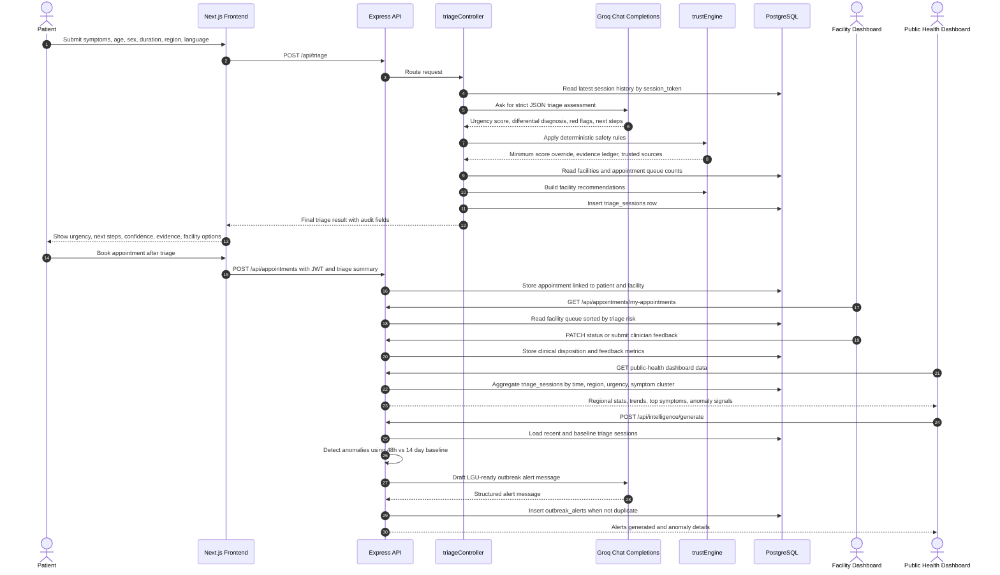

# Haliya System Flow Diagrams

Use Mermaid Live Editor to convert these diagrams into an image:

1. Open `https://mermaid.live/`
2. Paste one Mermaid block below into the editor
3. Use the export/download action to save as SVG or PNG

Recommended format:

- `SVG` for README, websites, and documents that need sharp scaling
- `PNG` for presentation slides or quick sharing

## System Architecture Flow

```mermaid
flowchart TB
  user["Patient or Guest User"]
  facilityUser["Facility User"]
  publicHealthUser["Public Health or Admin User"]

  subgraph frontend["Frontend: Next.js App Router"]
    landing["Landing and shared AppHeader"]
    triagePage["/triage page"]
    symptomForm["SymptomForm"]
    triageResult["TriageResult"]
    historyPage["/history page"]
    patientDashboard["/dashboard/patient"]
    facilityDashboard["/dashboard/facility"]
    publicHealthDashboard["/public-health dashboard"]
    apiClient["frontend/src/lib/api.ts"]
  end

  subgraph backend["Backend: Express API"]
    appRoutes["backend/app.ts route mounting"]
    haliyaRoutes["/api haliyaRoutes"]
    authRoutes["/api/auth routes"]
    appointmentRoutes["/api/appointments routes with verifyJWT"]
    patientFacilityRoutes["/api/patients and /api/facilities"]
    triageController["triageController"]
    intelligenceController["healthIntelligenceController"]
    appointmentController["appointmentControllers"]
    trustEngine["trustEngine safety rules and evidence ledger"]
  end

  subgraph ai["AI Integration: Groq"]
    groqTriage["Triage JSON assessment"]
    groqHistory["Patient health summary"]
    groqOutbreak["LGU-ready outbreak alert text"]
  end

  subgraph data["Data Layer: PostgreSQL via Drizzle"]
    triageSessions["triage_sessions"]
    facilities["facilities"]
    appointments["appointments"]
    outbreakAlerts["outbreak_alerts"]
    usersPatients["users, patients, consultations"]
  end

  user --> landing
  user --> triagePage
  triagePage --> symptomForm
  symptomForm --> apiClient
  apiClient -->|"POST /api/triage"| haliyaRoutes
  haliyaRoutes --> triageController
  triageController -->|"build prompt with symptoms and history"| groqTriage
  groqTriage --> triageController
  triageController --> trustEngine
  trustEngine --> triageController
  triageController -->|"read active/searchable facilities and queue counts"| facilities
  triageController --> appointments
  triageController -->|"store anonymous assessment"| triageSessions
  triageController --> apiClient
  apiClient --> triageResult

  user --> historyPage
  historyPage --> apiClient
  apiClient -->|"GET /api/triage/history and /api/triage/health-summary"| triageController
  triageController --> triageSessions
  triageController --> groqHistory

  user --> patientDashboard
  patientDashboard --> apiClient
  apiClient -->|"GET/PATCH patient profile"| patientFacilityRoutes
  apiClient -->|"GET facilities, POST appointments"| appointmentRoutes
  patientDashboard -->|"optional pre-booking assessment"| apiClient
  appointmentRoutes --> appointmentController
  appointmentController --> appointments
  appointmentController --> facilities
  appointmentController --> usersPatients

  facilityUser --> facilityDashboard
  facilityDashboard --> apiClient
  apiClient -->|"JWT protected queue, status, feedback"| appointmentRoutes
  appointmentController -->|"clinician correction and confusion matrix"| appointments

  publicHealthUser --> publicHealthDashboard
  publicHealthDashboard --> apiClient
  apiClient -->|"dashboard summary, regional stats, trends, alerts, anomalies"| haliyaRoutes
  haliyaRoutes --> intelligenceController
  intelligenceController --> triageSessions
  intelligenceController -->|"statistical anomaly engine"| intelligenceController
  intelligenceController -->|"POST /api/intelligence/generate"| groqOutbreak
  groqOutbreak --> intelligenceController
  intelligenceController --> outbreakAlerts
  outbreakAlerts --> publicHealthDashboard

  appRoutes --> haliyaRoutes
  appRoutes --> authRoutes
  appRoutes --> appointmentRoutes
  appRoutes --> patientFacilityRoutes
```

## AI Triage and Public Health Intelligence Flow

## Diagram Basis

These diagrams are based on the current implementation paths:

- `frontend/src/app/triage/page.tsx`
- `frontend/src/app/dashboard/patient/page.tsx`
- `frontend/src/app/dashboard/facility/page.tsx`
- `frontend/src/components/public-health/PublicHealthCommandCenter.tsx`
- `frontend/src/lib/api.ts`
- `backend/app.ts`
- `backend/routes/haliyaRoutes.ts`
- `backend/routes/appointmentRoutes.ts`
- `backend/controllers/triageController.ts`
- `backend/controllers/healthIntelligenceController.ts`
- `backend/controllers/appointmentControllers.ts`
- `backend/services/trustEngine.ts`
